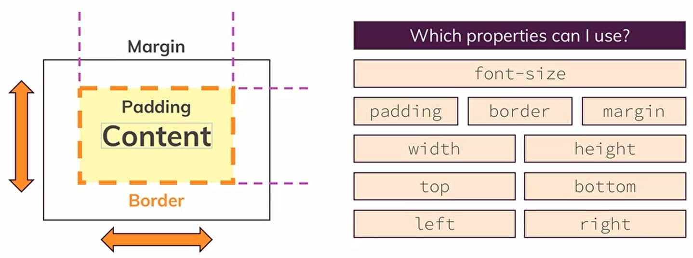
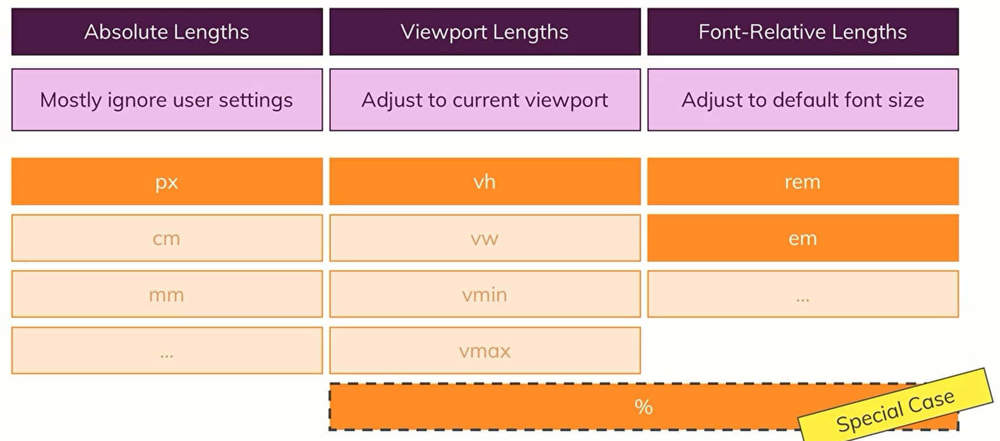
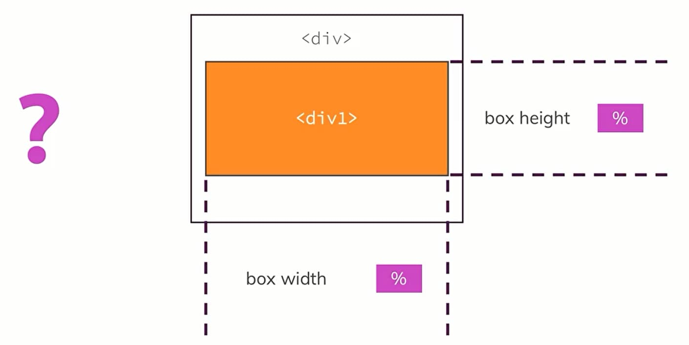
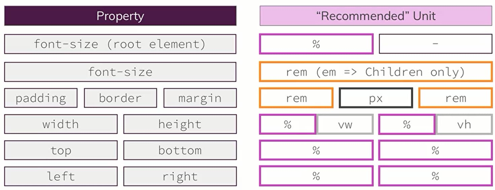

## Unit


## Where Unit Matter



## How is the Size Calulated

::: tip

字体**font: 75%** 参照的是浏览器字体设置

:::



## % Units Calculated

::: tip

与containing block有关

:::



### 3 Rules to 

::: tip

如果**position:abosulte;** 没有找到对应的ancestor则以viewport的大小作为百分比参考

:::


## min-widthheight & max-widthheight

::: tip

结合 :one: width的相对值 :two: min max的绝对值 来控制展示效果，如图片的展示

:::

```css
.container{
    width: 800px;
    max-width: 100%; /*当屏幕小于800px时，就以当前大小为准，而不是800px*/
}
```


--------


### @media max-width vs min-width ⭐⭐⭐

- `@media (min-width: 800px) { … }` - for browser’s viewport width equal or wider than 800px;
- `@media (max-width: 800px) { … }` - for browser’s viewport width equal or narrower than 800px.


```css
body {
    /* default styles here, 
    targets mobile first */
}

@media screen and (min-width:480px) {
    /* style changes when the screen gets larger */
}

@media screen and (min-width:800px) {
    /* And even larger */
}
```


```css
body {
    /* default styles here, 
    targets desktops first */
}

@media screen and (max-width:800px) {
    /* style changes when the screen gets smaller */
}

@media screen and (max-width:480px) {
    /* And even smaller */
}
```


## font-size with rem & em❤️

::: tip

dynamic for responsive design

:one: rem relative size compared to the root element

:::

em会乘以一个value,如浏览器默认设置的字体大小medium是16px,那么**font-size: 1.1em;** 最终计算的大小是1.1x16  = 17.6px

em会有继承的问题，这样会导致很混乱


### rem😊

::: tip

响应式开发的关键

rem的作用：take the font size that is set by the browser setting. r stands the root element

:::

浏览器的默认的大小是16px;通过如下的代码设置

```scss
html{
	font-size:62.5%;  // 将16px转换成10px,这样方便在编程的时候方便计算
}

.text-name{
    font-size: 2rem;  // 则会计算成20px
}
```


## Viewport Unit vw & vh

::: tip

value代表的是percentage,refers to the viewport

:one: vmin vmax 代表取当前窗口width,height中最笑最大值

:::

```css
width: 80vw;
height: 100vh;

/* vmin vmax*/ 
width: 80vmin;
```


### vw & percent❤️

```scss
width: 100vw;
max-width: 100%;
```


## Which Unit should choose



## Use auto to center element

::: tip

"margin:auto" only works for block level elements with a explicitly assigned width length

:::

``` css {2-3}
.plan__list {
  width: 80vw;
  margin: auto;
  text-align: center;
}
```

 


## 

