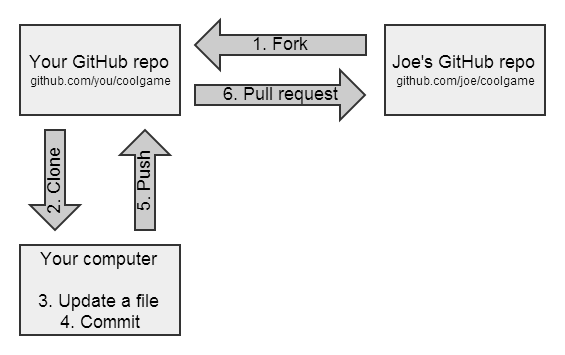

---
prev:
  text: Back To 目录
  link: /git/
---

# github fork 详解

## 使用背景

> 我在学习 vue3 + typescirpt 的项目实践，但源码本身的注释并没有多少注释，这时虽然可以直接 clone 代码，我同时又希望这份代码可以与远端仓库保持一致，所以顺道了解 fork 这个操作

## 概念

fork 是 github 上的操作，使用 fork 功能会在 github 上，给你创建一个与该项目一样的同名项目。其实就是复制该项目，包括其中的文件，提交的历史，issue,和其他的一些内容，复制后的仓库存放于你自己的 github 账号下

1. fork 一下 Joe 的 github 的仓库地址，到我们自己的 github 仓库下
2. git clone 到本地电脑中
3. 我们做一些代码的修改
4. 本地进行 commit
5. push 到我们自己的仓库中
6. 发起 Pull request
   如果对方接受了我们的 pull request,那么我们做的一些修改，就可以合入到他的仓库中了，整个流程就走完了。

关联上游仓库，可以保证后面可以同步上游仓库的代码
`git remote add upstream XX`

如果用github desktop 来fork，只需要一路跟着可视化选项选即可

由于我只需要同步上游代码即可 不需要上传代码
`git fetch upstream`

## 参考

[fork 参考](https://blog.csdn.net/liuqiao0327/article/details/110671028)
