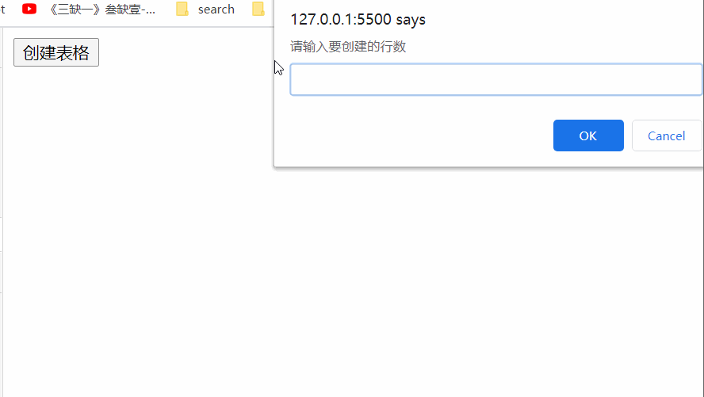

## 1 创建节点

### 1.1 createElement 创建元素节点

### 1.2 createTextNode 创建文本节点

### 1.3 appendChild 添加元素

如在tasks列表中添加一个新的task

```js
//	Create element
const li = document.createElement("li");
// Add class
li.className = 'collection-item';
//	Add id
li.id = 'new-item';
//	Add attribute
li.setAttribute('title','New Item');

// Create text node and append
li.appendChild(document.createTextNode('Hello World'));


//	Create new link element
const link = document.createElement('a');
// Add className
link.className = 'delete-item secondary-content';
//	Add icon html
link.innerHTML = '<i class="fa fa-remove"></i>';

//	Append link into li
li.appendChild(link);

//	Append li as child to ul
document.querySelector('ul.collection').appendChild(li);
```

### 1.4  createDocumentFragment文档碎片

1. 相当于一块缓存
2. 用于暂时存储要添加的元素
3. 相比使用innerHTML拼接与直接在父元素中使用appendChild效率会高很多


----------


## 2 replace element

### 2.1 replaceChild

```js
//	Create Element
const newHeading = document.createElement('h2');
//	Add id
newHeading.id = 'task-title';
//	New text node
newHeading.appendChild(document.createTextNode('Task List'));

// Get the old heading
const oldHeading = document.getElementById('task-title');
//	Parent
const cardAction = document.querySelector('.card-action');

//	Replace
cardAction.replaceChild(newHeading,oldHeading);
```


---------


## 3 remove element 

### 3.1 remove

```js
const lis = document.querySelectorAll('li');

// Remove list item
lis[0].remove();
```


### 3.2 removeChild

```js
const list = document.querySelector('ul');
// Remove list item
list.removeChild(lis[3]);
```


#### 3.2.1 删除全部子节点

```js
function clearTasks(){
    // taskList.innerHTML = '';
    
    while(taskList.firstChild){
        taskList.removeChild(taskList.firstChild);
    }
}
```


----------


## 4 Classes

```js
const fisrtLi = document.querySelector('li:first-child');
const link = firstLi.child[0];

link.className;
link.classList;
link.classList[0];

link.classList.add('test');
link.classList.remove('test');
```


----------


## 5 Attributes

```js
link.getAttribute('href');
link.setAttribute('href','https://google.com');

link.setAttribute('title','Google');
link.hasAttribute('title');	//	true or false

link.removeAttribute('title');

```


### 5.5 表格创建相关

#### 5.5.1 insertRow

1. table的操作

#### 5.5.2 insertCell

row的操作

#### 5.5.3  玩法：动态创建和删除表格⭐⭐



```js
let btn = document.getElementById("btn"),
    table = document.querySelector("table");

//  创建表格
btn.onclick = function () {
    let rows = parseInt(prompt("请输入要创建的行数"));
    let cols = parseInt(prompt("请输入要创建的列数"));

    // 表格体
    for (let i = 0; i < rows; i++) {
        // Create an empty <tr> element and add it to the i position of the table:
        let row = table.insertRow(i)
        row.className = "current"
        for (let j = 0; j < cols; j++) {
            // Insert new cells (<td> elements) at the j position of the "new" <tr> element:
            let cell = row.insertCell(j);
            cell.innerHTML = `(${i + 1},${j + 1})`;
        }
        
        // 删除按钮
        let cell = row.insertCell(cols);
        cell.innerHTML = "点击删除";
        cell.onclick = function () {
            row.remove();
        }
    }
}
```

### 5.6 insertBefore(插入元素，参照元素)

#### 5.6.1  插入第一个元素

如插入错误提示信息

```javascript
parentNode.insertBefore(targetElement,parentNode.children[0]);
```

### 5.7  cloneNode

#### 5.7.1 深层复制 true

#### 5.7.2 浅层复制 false 或者参数为空

```js
// 深层复制
let cloneEl = element.cloneNode(true)
// 浅层复制
let cloneEl1 = element.cloneNode()
let cloneEl2 = element.cloneNode(false)
```

