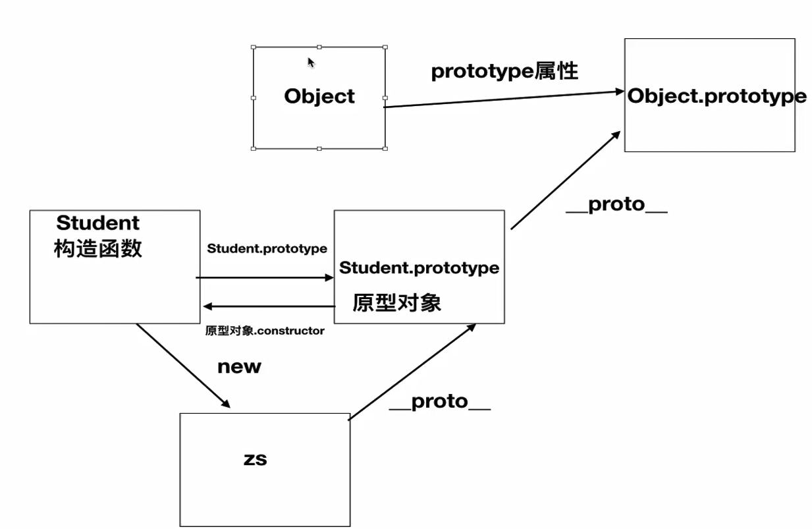
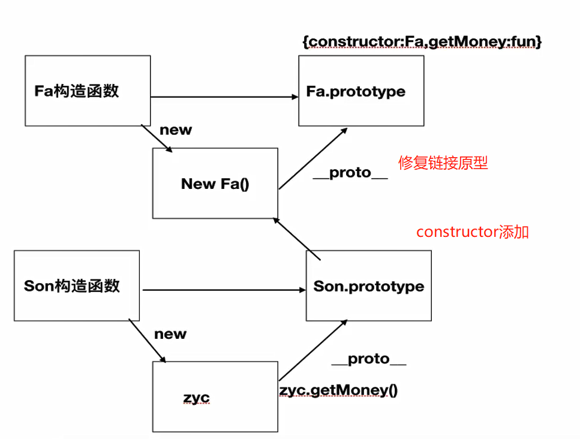

## 1 构造函数

### 1.1 创建对象直接量

### 1.2 new Object()构造函数

### 1.3 ES5 constructor function

```js
function ObjectName(){
	this.属性
	this.方法
}
```


```js
function Person(name,age){
	this.name = name;
    this.age = age;
    this.say = function(){
        console.log(`Hello my name is ${name}`);
    }
}
```


#### 1.3.1 添加成员

##### 1 通过this添加实例成员

##### 2 通过构造方法添加静态成员

######  只能通过构造方法访问

#### 1.3.2 添加方法

1. prototype添加方法

### 1.4 new 构造函数的过程

#### 1.4.1 在内存中创建一个新的空对象{}

#### 1.4.2. 让函数中的this指向这个空对象

#### 1.4.3. 开始执行函数体

#### 1.4.4. 返回该对象


## 2 prototype原型

1. 每一个**构造函数**都有一个**prototype对象**
2. Each object in Javascript has a prototype and a prototype is an object itself.


```js
function Person(name,age){
	this.name = name;
    this.age = age;
}

Person.prototype.say = function(){
    console.log(`Hello my name is ${name}`);
}

Person.hasOwnProperty('name');	//	true;
Person.hasOwnProperty('say');	//	false;

```


### 2.1 在该对象定义方法和属性

```js
ConstructorName.prototype = {
    // 很重要，不能漏掉，否则会覆盖之前的prototype,数据丢失
	constructor: ConstructorName,
	function1: function(){},
	funciton2: function(){}
}
```

1. 将来**所有的实例都能共享**
2. 节省了内存

### 2.2 constructor原型

1. 对应构造函数


### 2.3 \_\_proto\_\_与propotype

1. **每一个对象**都有一个 \_\_proto\_\_属性
2. 实例的 \_\_proto\_\_指向构造函数的propotype


### 2.4 原型链

1. new一个实例会产生一个实例对象，实例对象有\_\_proto\_\_属性



### 2.5 propotype玩法

#### 2.5.1 Vue设置对象

```js
// Vue原型上挂载axios
Vue.propotype.$http = axios
// Vue原型上挂载elementui的Message组件
Vue.propotype.$message = Message
```


## 3 继承

### 3 .1 call方法

1. 可以实现函数调用
2. 可以改变函数中的this指向 

### 3.2 属性继承

### 3.3. 方法继承



```js
function Father(name) {
    this.name = name;
}

Father.prototype.getMoney = function(){
    console.log(`Father money`);
}

function Son(name) {
    //	属性继承
    Father.call(this, name);
}
//	方法继承
Son.prototype = Object.create(Father.prototype);
Son.prototype.constructor = Son;

const son = new Son('hzz');

/**
Son {name: "hzz"}
name: "hzz"
__proto__: Father
    constructor: ƒ Son(name)
    __proto__: Object
 */
console.log(son)
son.getMoney();
```


----------


### 3.5 Object.create 方法

1. 创建一个对象,方式1

```js
const personPropotypes = {
    language: 'js',
    greeting: function(){
        return `Hello there ${this.firstName} ${this.lastName}`;
    }
}

const mary = Object.create(personPropotypes);
mary.firstName = 'Mary';
mary.lastName = 'Williams';

console.log(mary.greeting());
console.log(mary.language)
```


2. 创建一个对象，方式2

```js
const personPropotypes = {
    language: 'js',
    greeting: function(){
        return `Hello there ${this.firstName} ${this.lastName}`;
    }
}

const mary = Object.create(personPropotypes,{
    firstName: {value: 'Mary'},
    lastName: {value: 'Williams'}
});

console.log(mary.greeting());
console.log(mary.language)
```

