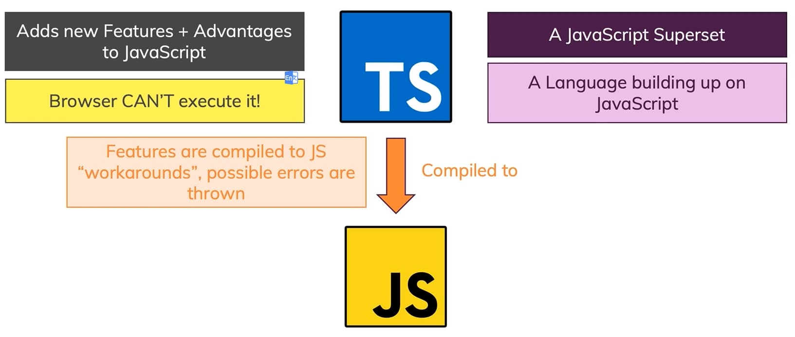

## TypeScript


## TypeScript与JavaScript

- TypeScript兼容JavaScript的所有特性，并且在这基础上提供了强大的**TypeScript‘s type system**
- 另外TypeScript能够在程序执行前能够识别错误的代码行为，降低bugs的产生




### 类型推断

能够自动进行类型推断

```typescript
let helloWorld = "Hello World";
        let helloWorld: string
```

### 类型定义

:::: code-group
::: code-group-item JavaScript

```js
const user = {
  name: "Hayes",
  id: 0,
};
```

:::
::: code-group-item TypeScript

```typescript
interface User {
  name: string;
  id: number;
}

const user: User = {
  name: "Hayes",
  id: 0,
};
```

:::
::::


### 类型构成

#### Unions

```typescript
type MyBool = true | false;
type WindowStates = "open" | "closed" | "minimized";
type LockStates = "locked" | "unlocked";
type PositiveOddNumbersUnderTen = 1 | 3 | 5 | 7 | 9;

function getLength(obj: string | string[]) {
  // 既能返回string.length也能返回Array.length
  return obj.length;
}
```

### Generics

```typescript
interface Backpack<Type> {
  add: (obj: Type) => void;
  get: () => Type;
}

declare const backpack: Backpack<string>;
```


### Structural Type System

::: tip

One of TypeScript’s core principles is that **type checking focuses on the *shape*** that values have

:::

```typescript
interface Point {
  x: number;
  y: number;
}
 
function logPoint(p: Point) {
  console.log(`${p.x}, ${p.y}`);
}
```

:::: code-group
::: code-group-item object

```js
const point = {x: 23,y: 32};
logPoint(point);
// focus on shape
const rect = { x: 33, y: 3, width: 30, height: 80 };
logPoint(rect);
```

:::
::: code-group-item class

```js
class VirtualPoint {
  x: number;
  y: number;
 
  constructor(x: number, y: number) {
    this.x = x;
    this.y = y;
  }
}
 
const newVPoint = new VirtualPoint(13, 56);
// function logPoint(p: Point)
logPoint(newVPoint);
```

:::
::::

---------


## TypeScript对比Java

在Typescript中处理的类型与Java之中强一致性的类型有很大的不同

```typescript
class Car {
  drive() {
    // hit the gas
  }
}
class Golfer {
  drive() {
    // hit the ball far
  }
}
// No error
let w: Car = new Golfer();
```

### Types as Sets

In Java, it’s meaningful to think of a one-to-one correspondence between runtime types and their compile-time declarations.

In TypeScript, **it’s better to think of a type as a *set of values* that share something in common**. Because types are just sets, **a particular value can belong to *many* sets at the same time**.

```typescript
interface Pointlike {
  x: number;
  y: number;
}
interface Named {
  name: string;
}
 
function logPoint(point: Pointlike) {
  console.log("x = " + point.x + ", y = " + point.y);
}
 
function logName(x: Named) {
  console.log("Hello, " + x.name);
}
 
const obj = {
  x: 0,
  y: 0,
  name: "Origin",
};
 
logPoint(obj);
logName(obj);
```

