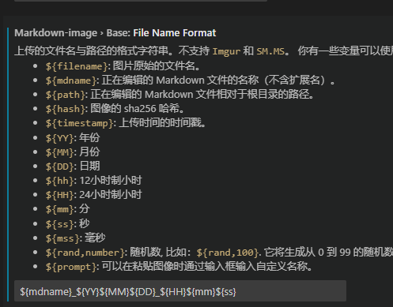
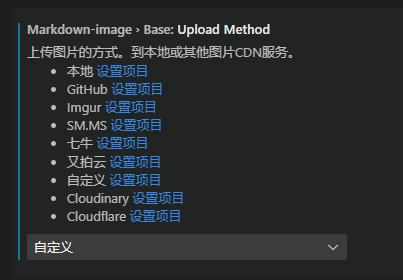
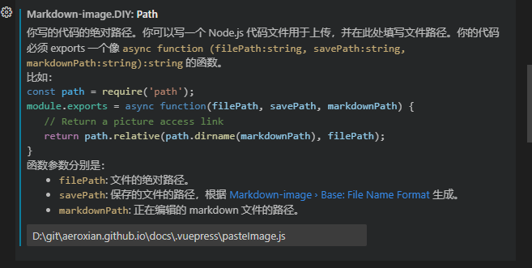

# 博客图片设置

::: tip

在 github 上使用的仓库 `https://<USERNAME>.github.io/` 这样在部署的时候 base 就是 `/`

在使用 markdown 引入图片的时候就不用关心 base

因为现在的 md 编写软件基本都可以直接粘贴图片到 md 文件里面,这个操作是十分方便的
但是各软件对图片的存放路径的处理各不相同,需要自己单独适配

:::

因为架构直接拿的静默的,图片存放形式我觉得也十分合理,就沿用下来了

文档中的所有的图片都存放在`.vuepress/public/images/#模块名称#/xxx.png`

- MarkText(仓库两年没更新了) 这个是我现在用的,在首选项中可以配置粘贴的图片存放位置,粘贴的时候直接生成到目标存放位置,并且 md 中显示的直接就是相对路径,所以即便是打包后也是正常显示的,麻烦的点在,每写一个模块都得重新设置首选项图片的存放路径

- Obsidian 这个只是简单使用了下,也是支持直接粘贴图片,但是图片存放路径不好管理,即使设置了图片存放位置,图片在 md 文件中的显示也不是对应的相对位置

- Typora 这个收费了就没用过了,@静默 的方式为在 yaml 中设置 typora-root-url 告诉这个 md 下的图片对应的相对路径,不过不清楚直接粘贴的图片是否会按照这个配置存放
- VS-Code 插件-MarkdownImage 借助这个插件直接实现在 vscode 中编写 md 文件,因为 vuepress 搭建的,不时要写 vue 代码和配置,并且可以通过插件暴露的回调来自定义一些个性化操作

## VScode Markdown Image 插件使用

捣鼓了一下,发现可以 DIY 插件粘贴图片时的动作

1. 自定义保存文件的名称
   
2. 设置模式为自定义保存
   
3. 设置配置文件路径
   
4. 自定义粘贴图片动作

   ```js
   /* 配置Vscode Markdown Image 插件 图片存放上传 */
   const os = require("os")
   const path = require("path")
   const fse = require("fs-extra")
   const { writeFile, rename } = require("node:fs/promises")
   const imageRoot =
   	"D:\\git\\aeroxian.github.io\\docs\\.vuepress\\public\\images"
   const logFilePath = "D:/git/aeroxian.github.io/docs/.vuepress/log.txt"
   module.exports = async function (filePath, savePath, markdownPath) {
   	// Return a picture access link
   	const dirNameList = markdownPath.split("\\")
   	// 以md文件的上一级目录名字作为存放图片的文件夹名
   	const topDirName = dirNameList[dirNameList.length - 2]
   	const newImgPath = `${imageRoot}\\${topDirName}\\${savePath}`
   	// path
   	await fse.move(filePath, newImgPath)
   	// 返回的是显示在md文件中图片的相对路径
   	return path
   		.relative(path.dirname(markdownPath), newImgPath)
   		.replace(/\\/g, "/")
   }

   // 调试方法 写入log.txt文件
   function log(...args) {
   	// 这是一个promise
   	// os.EOL nodejs 换行符 flag:a+在原有内容追加
   	const str = os.EOL + [...args].join(" | ")
   	writeFile(logFilePath, str, {
   		encoding: "utf-8",
   		flag: "a+",
   	}).then(() => {})
   }
   ```

## Squoosh 图片压缩

使用 Google 的在线版[Squoosh](https://squoosh.app/) 工具进行图片压缩

如： 2.59 MB 压缩成 186 KB

## 使用 Github 图床

> 背景： 考虑到 gitee 图床失效，cdn jsdelivr 不能访问，阿里云存储和流量收费以及日后图片迁移等的问题。决定还是使用 github 作为图床，将博客。毕竟我这是一个开源博客，并没有盈利，交给开源 github 管理，比较复合我的需求。
>
> 我的想法：能访问到博客就意味着能访问到图片，只不过有个图片加载速度问题。线上速度慢一点我能接收，因为看笔记的时候有 typora 作为辅助，其次可以考虑 jsdelivr CDN 加速方案。

vuepress+typora。考虑到线上访问网站时能够显示图片，以及在本地编辑 typora 时方便预览图片。决定将这两个内容兼容起来。

## 参考

[vuepress 静态资源-public](https://v2.vuepress.vuejs.org/zh/guide/assets.html#public-%E6%96%87%E4%BB%B6)
[Vscode Markdown Image 插件使用](http://www.aqpower.cn/2022/08/18/VScode%E4%B9%9F%E5%8F%AF%E4%BB%A5%E5%BE%88%E5%A5%BD%E7%9A%84%E7%BC%96%E5%86%99markdown%E6%96%87%E4%BB%B6/)
