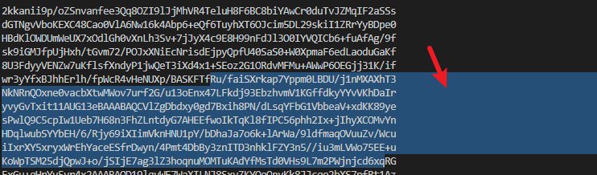

## 部署

::: tip 

部署的时候使用`base: '/'` 的方式部署

:::

> github actions的自动构建部署的好处就是，每次提交文件到github之后，它就会帮我们build和部署，网站的内容就会自动更新，非常方便
> 
> github actions可玩性非常高,可以指定某个动作触发


> vuepress指南-部署，提供的文件，自己做了一些修改如node.js版本，去掉cache dependcies,使用npm而不是yarn来构建

可以看到github actions将构建的内容放到**gh-pages**分支


以上步骤是使用github actions的自动构建功能，但是不能访问页面，需要设置github pages的信息


到此为止，进行访问 https://aeroxian.github.io/


## 遇到的问题

GitHub actions报错`root/id_rsa`之类的不对

#### 解决

问题点:私钥的格式不对

git bash执行 `cat ~/.ssh/id_rsa`



框选复制到仓库secrets时保留了空行导致

去掉换行恢复正常

## 我的GITHUB ACTIONS 参考

```yml
name: auto_deploy

on:
  # 每当 push 到 main 分支时触发部署
  push:
    branches: [master]
  # 手动触发部署
  workflow_dispatch:
jobs:
  docs:
    runs-on: ubuntu-latest

    steps:
      - uses: actions/checkout@v2
        with:
          # “最近更新时间” 等 git 日志相关信息，需要拉取全部提交记录
          fetch-depth: 0

      - name: Setup Node.js
        uses: actions/setup-node@v1
        with:
          # 选择要使用的 node 版本
          node-version: "18.15.0"

      # 缓存 node_modules
      - name: Cache dependencies
        uses: actions/cache@v2
        id: yarn-cache
        with:
          path: |
            **/node_modules
          key: ${{ runner.os }}-yarn-${{ hashFiles('**/yarn.lock') }}
          restore-keys: |
            ${{ runner.os }}-yarn-

      # 如果缓存没有命中，安装依赖
      - name: Install dependencies
        if: steps.yarn-cache.outputs.cache-hit != 'true'
        # run: npm ci
        # run: yarn install
        run: yarn --frozen-lockfile

      # 运行构建脚本
      - name: Build VuePress site
        run: npm run docs:build

      # 查看 workflow 的文档来获取更多信息
      # @see https://github.com/crazy-max/ghaction-github-pages
      - name: Deploy to GitHub Pages
        uses: crazy-max/ghaction-github-pages@v2
        with:
          # 部署到 gh-pages 分支
          target_branch: gh-pages
          # 部署目录为 VuePress 的默认输出目录
          build_dir: docs/.vuepress/dist
        env:
          # @see https://docs.github.com/cn/actions/reference/authentication-in-a-workflow#about-the-github_token-secret
          GITHUB_TOKEN: ${{ secrets.GITHUB_TOKEN }}
          GH_PAT: ${{ secrets.ACCESS_TOKEN }}

      # - name: Mirror the Github organization repos to Gitee.
      #   uses: Yikun/hub-mirror-action@master
      #   with:
      #     src: "github/Aeroxian"
      #     dst: "gitee/aeroxian"
      #     dst_key: ${{ secrets.GITEE_PRIVATE_KEY }}
      #     dst_token: ${{ secrets.GITEE_TOKEN }}
      #     static_list: "Aeroxian_Blog"
      #     clone_style: "ssh"
      #     force_update: true
      #     debug: true
      - name: Sync to Gitee
        uses: wearerequired/git-mirror-action@master
        env:
            SSH_PRIVATE_KEY: ${{ secrets.GITEE_RSA_PRIVATE_KEY }}
        with:
            source-repo: git@github.com:Aeroxian/aeroxian.github.io.git
            destination-repo: git@gitee.com:aeroxian/aeroxian.git

      - name: Build Gitee Pages
        uses: yanglbme/gitee-pages-action@main
        with:
          # 注意替换为你的 Gitee 用户名
          gitee-username: aeroxian
          # 注意在 Settings->Secrets 配置 GITEE_PASSWORD
          gitee-password: ${{ secrets.GITEE_PASSWORD }}
          # 注意替换为你的 Gitee 仓库，仓库名严格区分大小写，请准确填写，否则会出错
          gitee-repo: aeroxian/aeroxian
          # 要部署的分支，默认是 master，若是其他分支，则需要指定（指定的分支必须存在）
          branch: gh-pages
```

::: tip 实现的功能:

1. 提交代码到master时,触发action

2. 检查依赖缓存/下载依赖

3. 构建github pages

4. 同步代码到gitee gitee作为国内镜像

5. 缓存依赖

6. 构建gitee pages


用到的库:

[Github | wearerequired/git-mirror-action](https://github.com/wearerequired/git-mirror-action)

[Github | yanglbme/gitee-pages-action](https://github.com/yanglbme/gitee-pages-action)

[Github | crazy-max/ghaction-github-pages](https://github.com/crazy-max/ghaction-github-pages)

以上库用到的key设置请到对应仓库查看

:::

## 参考

[部署 | VuePress (vuejs.org)](https://v2.vuepress.vuejs.org/zh/guide/deployment.html#github-pages)
