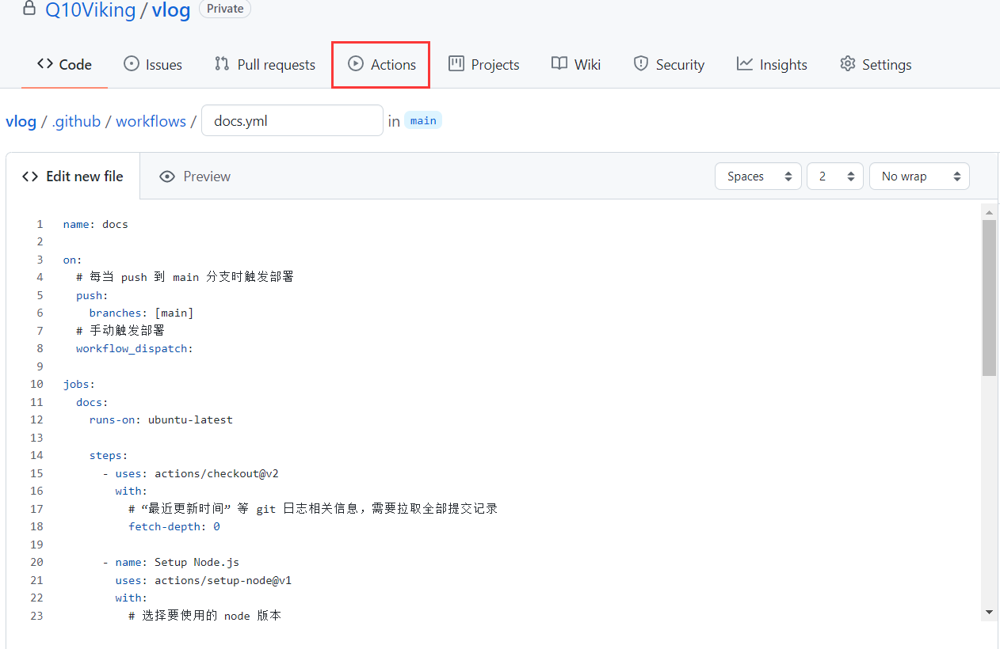
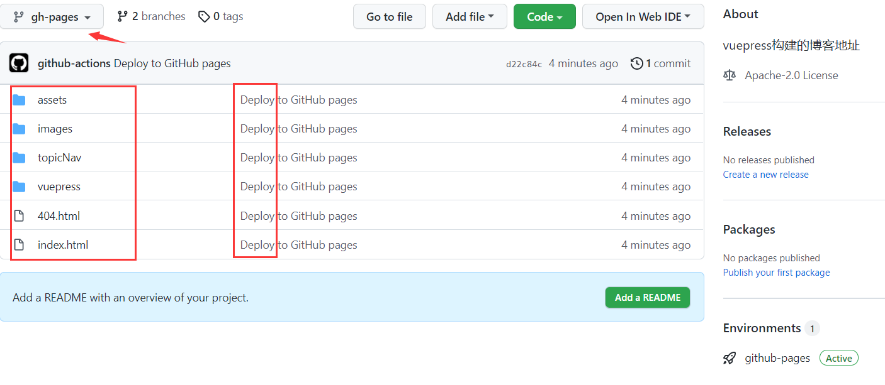
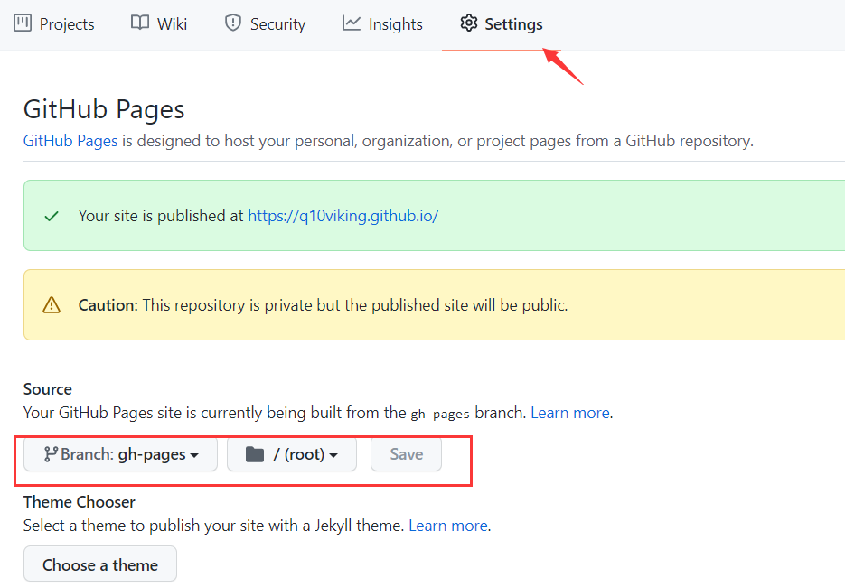
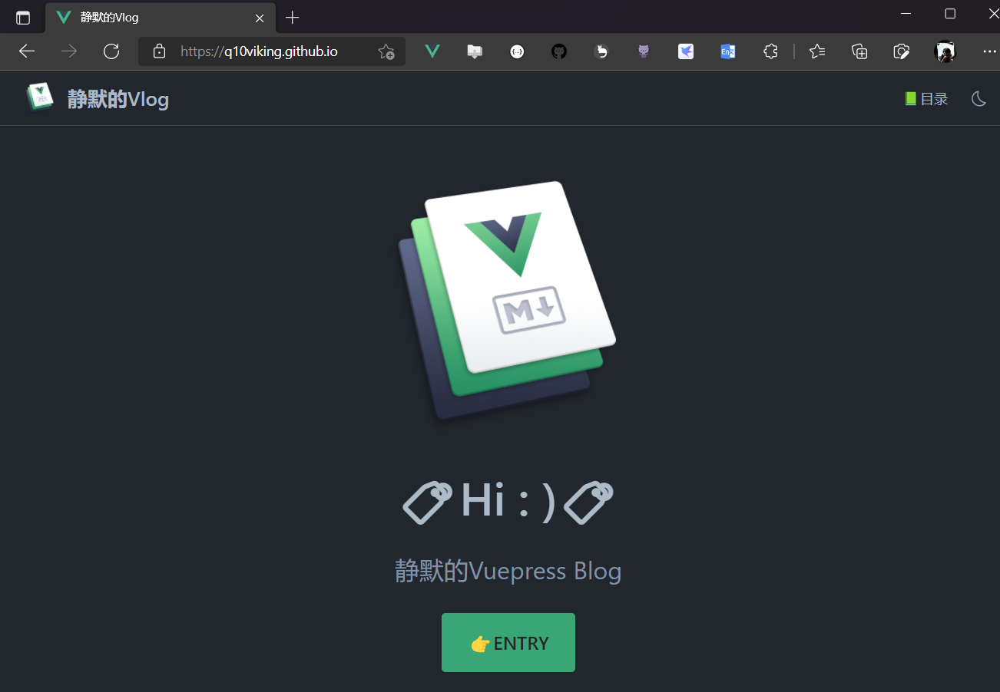

## 部署

::: tip 

部署的时候使用`base: '/'` 的方式部署

:::

> github actions的自动构建部署的好处就是，每次提交文件到github之后，它就会帮我们build和部署，网站的内容就会自动更新，非常方便
> 
> github actions可玩性非常高,可以指定某个动作触发

> vuepress指南-部署，提供的文件，自己做了一些修改如node.js版本，去掉cache dependcies,使用npm而不是yarn来构建

可以看到github actions将构建的内容放到**gh-pages**分支

以上步骤是使用github actions的自动构建功能，但是不能访问页面，需要设置github pages的信息

到此为止，进行访问 https://aeroxian.github.io/

## 参考

[部署 | VuePress (vuejs.org)](https://v2.vuepress.vuejs.org/zh/guide/deployment.html#github-pages)
