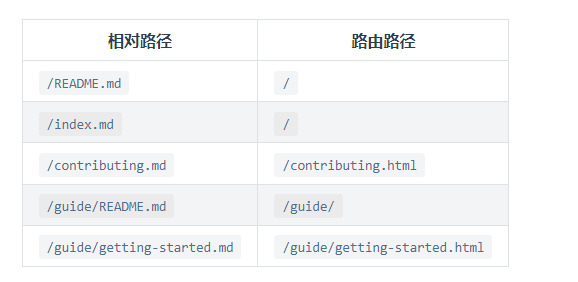

## docsearch

::: tip 

官方文档有两种方式来集成algolia docSearch. :one: 向algolia官方注册信息 :two: 自己构建爬虫

由于第一种方式简单，只需要在config中配置若干项即可

```js
docsearchPlugin({
  appId: 'XX',  // Add your own Application ID
  apiKey: 'XX', // Set it to your own *search* API key
  indexName: 'XX'
})
// 这些配置项都会在注册申请使用algolia docSearch 通过官方邮件获取到
// 不过因为algolia docSearch是外国网站，得自己想办法
```

:::

----------

## 可能出现的问题

配置完对应key后，并没有检索出对应的结果

此时需要到[官方爬虫后台](https://crawler.algolia.com/admin)检查对应爬虫代码


```js
//特别注意以下几个属性 查看路径是否匹配实际访问路径
startUrls: ["https://aeroxian.github.io/"],
discoveryPatterns: ["https://aeroxian.github.io/**"],
pathsToMatch: ["https://aeroxian.github.io/**"],
```

此外可以比对([docsearch | VuePress](https://v2.vuepress.vuejs.org/zh/reference/plugin/docsearch.html#%E4%BD%BF%E7%94%A8%E6%96%B9%E6%B3%95))

官方给的爬虫代码除以上问题,基本没有改动

## 我的问题记录

在配置完对应key后，并不能检索到搜索结果

由于[静默のBlog](https://q10viking.github.io/vuepress/) 集成algolia docSearch的方式为自己构建爬虫，而我是直接通过官方推荐的形式引入，并且静默大佬更改过路由跳转路径,导致爬虫爬取出来的路径不是实际路由路径

以下是vuepress官方路由匹配方式



把路由路径匹配上即可


## 参考

[aloglia 官网](https://www.algolia.com/) :star:

[docSearch配置](https://v2.vuepress.vuejs.org/zh/reference/plugin/docsearch.html#%E5%AE%89%E8%A3%85)

[Run your own | DocSearch by Algolia](https://docsearch.algolia.com/docs/legacy/run-your-own/#set-up-your-environment)

[Algolia 爬虫后台](https://crawler.algolia.com/admin)
