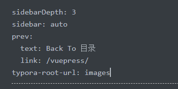
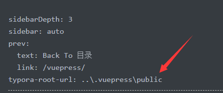

## 在专题文件夹下存放图片



最终生成的图片路径会成为这样。

```html

```

而vuepress部署上线正确访问的图片路径是

```html
http://localhost:8080../.vuepress/public/images/vuepress/image-20211126054031455.png
```

**所以这种方案不可取**

## 在vuepress的图片目录下创建图片文件夹

> 根据vuepress访问图片目录的规定，必须在docs\.vuepress\public目录下。但是为了兼容typora，需要重新设定路径。


但是如果这样设置的话，也还是不行

```markdown
typora-root-url: ..\.vuepress\public\images\vuepress

```

因为vuepress生成页面之后，链接成如下模式

```html

```

而我们的图片并不在public根目录下，访问不到。而是在public../.vuepress/public/images/vuepress目录下。

### 重新设定typora路径目录⭐⭐



而此时markdown复制图片的指定到我们分好类的文件夹中，typora会自动生成路径，成如下模式。

```markdown

```

**这样就解决了typora和vuepress访问路径的问题**

```html

```

## CDN加速

由于图片是放在github上的（因为我们的博客是放在github上的），图片的访问速度可能会有些慢。可以考虑一下CDN加速。

> 以下图片都使用了jsdelivr进行，加速。如果能看到图片，说明jsdelivr正常访问。


```html
https://cdn.jsdelivr.net/gh/Q10Viking/jsDelivrImagesTests/202206061642731.png
```


### github存放cdn加速的图片仓库

我在github上又开辟了一个仓库专门用来CDN加速的。当在typora编辑文档的时候，可以考虑使用PicGo上传图片到这个仓库。然后再typora中就会生成图片CDN的链接。

## 最终方案⭐⭐

1. （必须）在docs/public存放图片。为了区分专题图片，在docs/public../.vuepress/public/images目录下分别建立专题的文件夹
2. （必须）在typora中编辑文档的时候，设置图片路径为.vuepress\public,当拷问图片到文档后，就拷贝图片到指定的专题文件夹下。markdown图片路径在typora中会自动生成。
3. （可选）图片加速方案
   1. 在复制到文档中，先使用Squoosh工具将图片进行压缩
   2. CDN jsdelivr加速。为了防止jsdelivr访问失效。需要做好备份。先将图片复制vuepress指定的专题文件夹下。再通过PicGo上传到github仓库jsDelivrImagesTests中。这样如果以后jsdelivr不能访问，可以及时再typora文档中修改路径为docs/public专题目录下的路径。因为原始文件一直在这个目录中。只不过是修改了一下文件路径而已。
